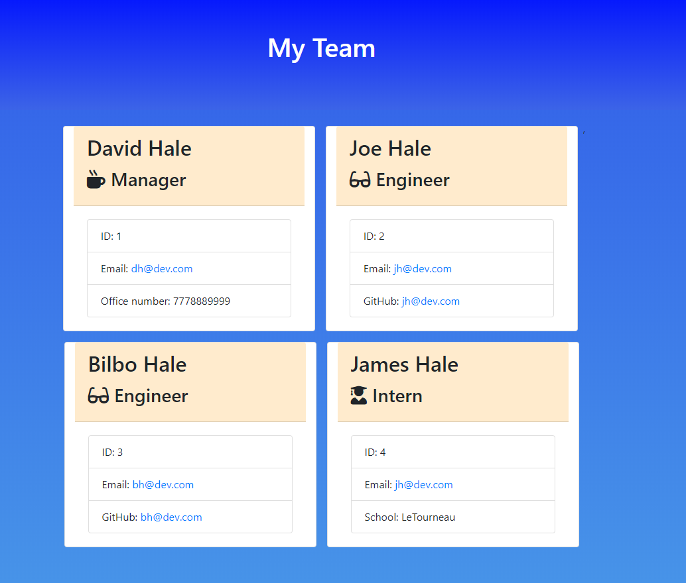
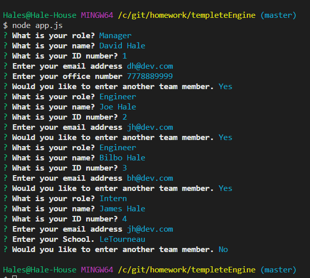

# Template Engine

## Description
The purpose of this project was to create a CLI interface that would generate HTML cards with very basic employee information on each card. Another aspect of this project was to write code that would integrate with code that was given to us. There were tests that our code had to pass as well as HTML templates that the code had to fit into. The project also used classes to accomplish many of these tasks. 

I add some basic css styling so that the page was not just a white page. I also gave the ability to create as many of each employee group as desired. 

[GitHub Repo](https://github.com/cloudflying87/teamCardGenerator)

